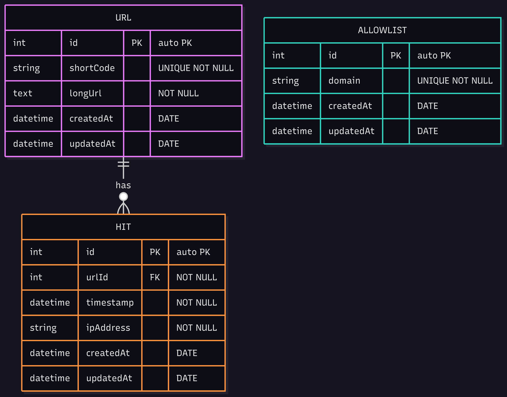

# URL Shortener Service

[](https://nestjs.com/)
[](https://www.typescriptlang.org/)
[](https://www.mysql.com/)
[](https://redis.io/)

A high-performance URL shortener service built with NestJS, MySQL, and Redis.

## 🚀 Quick Start

### Prerequisites
- Node.js v22+
- MySQL 8+
- Redis 8+

### ERP Diagram
**System design for url shortener service**


### Installation

1. Clone and install dependencies:
   ```bash
   git clone https://github.com/AhmedDR200/url_shortener.git
   cd url_shortener
   pnpm install
   ```

2. Configure environment:
   ```bash
   cp .env.example .env
   # Edit .env with your settings
   ```

3. Set up database:
   ```bash
   pnpm run db:migrate
   ```
**Note: If you are using a different database, you will need to modify the configuration in `src/config/config.ts`.**

4. Start the server:
   ```bash
   pnpm run start:dev
   ```

## 🔑 API Key Setup

1. Include the key in requests using the `x-api-key` header

## 📡 API Usage

**base_url: http://localhost:3000/api**

### Shorten a URL
```http
POST {{base_url}}/url/shorten
x-api-key: your-api-key

{
  "long_url": "https://example.com/very/long/url"
}
```

### Resolve a Short URL
```http
GET {{base_url}}/url/abc123
```

### Add to Allowlist
```http
POST {{base_url}}/url/allowlist
x-api-key: your-api-key

{
    "domain": "example.com"
}
```

## 🏗️ Architecture Decisions

### Storage (MySQL)
- **Why?** Relational database ensures data consistency for URL mappings and analytics
- **Tables**: `urls`, `hits`, `allowlist`

### Caching (Redis)
- **Why?** Reduces database load for frequently accessed URLs
- **TTL**: 1 hour for URL mappings

### Rate Limiting
- **Why?** Prevent abuse and ensure service availability
- **Limits**: 10 requests/minute per IP for public endpoints

## 📚 API Docs
Access interactive documentation at `http://localhost:3000/api/docs` when running locally.
apply `x-api-key` header with your api key in the documentation on all requests, but if you are using postman you can add it to the headers of shorten and allowlist requests